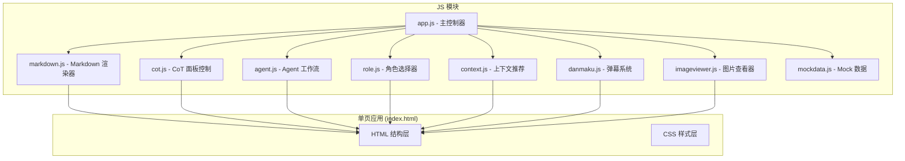
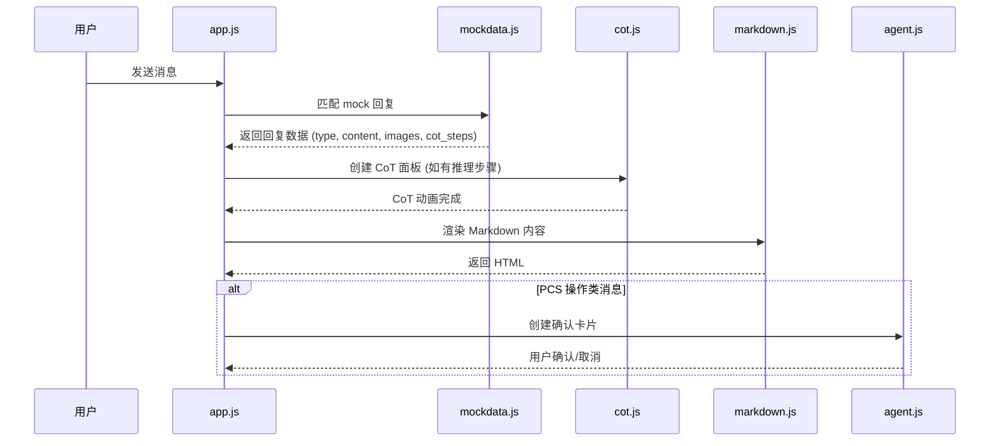

# 设计文档：FranklinWH 智能助手原型升级

## 概述

本设计文档描述 FranklinWH 智能助手前端原型的 8 项功能升级方案。项目基于现有的纯 vanilla HTML/CSS/JS 单页架构，无框架、无构建工具，所有功能在 `index.html` + `app.js` 中实现。

核心升级方向：
1. **消息渲染升级**：从纯文本升级为富 Markdown 渲染，支持图片、表格、代码块、提示卡片等
2. **交互增强**：CoT 推理面板、PCS 确认卡片、角色选择器、上下文推荐、弹幕推荐
3. **手势支持**：图片双指缩放、全屏模态浏览

设计原则：
- 所有功能在单个 HTML 文件 + 单个 JS 文件中实现（可拆分为多个 JS 模块文件通过 `<script>` 引入）
- 不引入任何外部框架或构建工具
- 所有数据为前端 mock 数据，无真实后端
- 保持现有 390x844 手机框架布局

## 架构

### 整体架构



### 消息处理流程



### 文件结构

```
├── index.html          # 主页面 (HTML + CSS)
├── styles.css          # 样式文件
├── app.js              # 主控制器：会话管理、消息收发、事件绑定
├── markdown.js         # 轻量 Markdown 解析器
├── cot.js              # CoT 推理面板
├── agent.js            # Agent 工作流 + 确认卡片
├── role.js             # 角色选择器
├── context.js          # 上下文感知推荐
├── danmaku.js          # 弹幕系统
├── imageviewer.js      # 图片查看器 (缩放 + 全屏)
└── mockdata.js         # 所有 mock 数据
```

## 组件与接口

### 1. Markdown_Renderer (`markdown.js`)

轻量级内联 Markdown 解析器，不依赖外部库。

```javascript
/**
 * 将 Markdown 文本解析为 HTML 字符串
 * @param {string} markdown - 原始 Markdown 文本
 * @returns {string} - 渲染后的 HTML
 */
function renderMarkdown(markdown) { ... }
```

支持的语法：
- `# H1` / `## H2` → 带品牌色左边框装饰的标题（H1: 4px, H2: 3px）
- `` → Image_Block（骨架屏 + 错误态 + 点击全屏 + alt 描述文字）
- `| col | col |` → 带交替行背景色的表格
- `` ```code``` `` → 深色背景代码块
- `**bold**` / `*italic*` / `[link](url)` → 基础内联样式
- `- list item` → 无序列表
- `1. list item` → 有序列表，步骤描述自动匹配圆形序号图标
- `> blockquote` → 引用块
- `⚠️ 注意事项` 行 → 橙色左边框高亮卡片
- `💡 专家建议` 行 → 蓝色左边框高亮卡片
- `⚙️` 行 → 设置/配置类视觉样式
- `📚 参考文档` 区域 → 引用文档列表
- `📖 来源：{文档名称}` → 来源标注区域

流式渲染策略：
- 使用增量 DOM 更新，仅追加新内容，不重新渲染已有内容
- 消息容器使用固定高度或 `min-height` 预留空间，避免内容跳动
- 滚动锚定：新内容追加时自动滚动到底部，但用户手动上滑时暂停自动滚动

### 2. CoT_Panel (`cot.js`)

```javascript
/**
 * 创建并插入 CoT 推理面板到消息列表
 * @param {HTMLElement} container - 消息容器
 * @param {Array<{label: string, detail: string}>} steps - 推理步骤
 * @param {Function} onComplete - 动画完成回调
 * @returns {HTMLElement} - CoT 面板 DOM 元素
 */
function createCoTPanel(container, steps, onComplete) { ... }
```

推理步骤固定为三步：
1. 查询数据 → `"正在查询 FranklinWH 设备数据…"`
2. 分析数据 → `"正在分析数据…"`
3. 归纳结果 → `"正在归纳结果..."`

折叠面板标题：
- 进行中：`"AI 智能助手正在思考你的需求..."`
- 完成后：`"思考完成"`

状态图标：
- 进行中：CSS 旋转动画的 spinner
- 完成：绿色 ✓ 图标

### 3. Agent 工作流 (`agent.js`)

```javascript
/**
 * 检测消息是否包含 PCS 操作意图
 * @param {string} message - 用户消息文本
 * @returns {{matched: boolean, type: string|null, params: object|null}}
 */
function detectPCSIntent(message) { ... }

/**
 * 创建确认卡片
 * @param {string} operationType - 操作类型
 * @param {object} params - 操作参数 {current, target, name}
 * @param {Function} onConfirm - 确认回调
 * @param {Function} onCancel - 取消回调
 * @returns {HTMLElement}
 */
function createConfirmationCard(operationType, params, onConfirm, onCancel) { ... }
```

四类 PCS 操作场景：
| 操作类型 | 关键词匹配 | 参数 |
|---------|-----------|------|
| 电网输入切换 | "grid charge", "电网充电" | mode: Grid/Solar |
| 取电限制调整 | "import limit", "取电限制" | value: 0-100 (A) |
| 能量输出策略 | "energy output", "输出策略" | strategy: Self/Export |
| 馈网限制调整 | "export limit", "馈网限制" | value: 0-100 (kW) |

缺少参数处理：
- 检测到意图但参数不完整时（`params: null`），触发追问消息引导用户补充缺失参数

### 4. Role_Selector (`role.js`)

```javascript
/**
 * 初始化角色选择器
 * @param {HTMLElement} container - 挂载容器
 * @param {Function} onRoleChange - 角色切换回调 (roleId: string) => void
 */
function initRoleSelector(container, onRoleChange) { ... }
```

预设角色：
| 角色 ID | 名称 | 图标 |
|--------|------|------|
| general | 通用智能助手 | 🤖 |
| device | 设备管理助手 | ⚙️ |
| energy | 能源分析专家 | ⚡ |
| service | 售后协同助手 | 🛠️ |

### 5. Context_Recommender (`context.js`)

```javascript
/**
 * 初始化上下文推荐器
 * @param {HTMLElement} container - 挂载容器
 * @param {Function} onSelect - 选择推荐问题回调 (question: string) => void
 */
function initContextRecommender(container, onSelect) { ... }

/**
 * 触发推荐显示（3秒延迟后滑入）
 * @param {string} roleId - 当前角色 ID
 */
function triggerRecommendation(roleId) { ... }
```

定时逻辑：
- 进入页面 / 切换角色后 3 秒显示
- 显示后 10 秒无交互自动隐藏
- 用户点击关闭按钮立即隐藏

### 6. Danmaku_Banner (`danmaku.js`)

```javascript
/**
 * 初始化弹幕系统
 * @param {HTMLElement} container - 挂载容器
 * @param {Function} onSelect - 点击弹幕回调 (question: string) => void
 */
function initDanmaku(container, onSelect) { ... }

/**
 * 淡出隐藏弹幕
 */
function hideDanmaku() { ... }
```

三行弹幕配置：
| 行 | 类别 | 颜色标签 | 滚动速度 |
|----|------|---------|---------|
| 1 | 基础能力 | 蓝色 `#3b82f6` | 30s |
| 2 | 操作能力 | 绿色 `#22c55e` | 25s |
| 3 | 服务能力 | 橙色 `#f59e0b` | 35s |

### 7. ImageViewer (`imageviewer.js`)

```javascript
/**
 * 打开全屏图片查看器
 * @param {string} src - 图片 URL
 */
function openImageViewer(src) { ... }

/**
 * 关闭全屏图片查看器
 */
function closeImageViewer() { ... }
```

手势支持：
- 双指缩放 (pinch-zoom)：通过 `touchstart` / `touchmove` / `touchend` 事件计算两指距离变化
- 缩放范围：1x ~ 3x
- 单击关闭全屏模态


## 数据模型

### Mock 回复数据结构

```javascript
/**
 * @typedef {Object} MockReply
 * @property {string} type - 回复类型: 'text' | 'markdown' | 'pcs_action' | 'no_match'
 * @property {string} content - Markdown 格式的回复内容
 * @property {string} [complexity] - 问题复杂度: 'simple' | 'complex'，决定回复详略程度
 * @property {Array<{label: string, detail: string}>} [cotSteps] - CoT 推理步骤
 * @property {string} [source] - 信息来源标注，如 "FranklinWH 安装手册 v3.2"
 * @property {Object} [pcsAction] - PCS 操作参数
 * @property {string} [pcsAction.type] - 操作类型
 * @property {string} [pcsAction.name] - 操作名称
 * @property {*} [pcsAction.currentValue] - 当前值
 * @property {*} [pcsAction.targetValue] - 目标值
 */
```

回复详略策略：
- `complexity: 'complex'`：回复包含分步说明、表格、注意事项等完整结构化内容
- `complexity: 'simple'`：回复直接给出答案，1-2 句话，不包含冗余结构

### 会话数据结构（扩展现有）

```javascript
/**
 * @typedef {Object} Session
 * @property {string} id - 会话 ID
 * @property {string} title - 会话标题
 * @property {Array<Message>} messages - 消息列表
 * @property {string} roleId - 当前角色 ID (新增)
 * @property {number} createdAt - 创建时间戳
 * @property {number} updatedAt - 更新时间戳
 */

/**
 * @typedef {Object} Message
 * @property {'user'|'bot'} role - 消息角色
 * @property {string} text - 原始文本 (用户消息) 或 Markdown 文本 (bot 消息)
 * @property {string} [type] - 消息类型 (新增): 'text' | 'markdown' | 'pcs_confirm' | 'pcs_result'
 * @property {number} time - 时间戳
 */
```

### 角色配置数据

```javascript
const ROLES = [
  { id: 'general', name: '通用智能助手', icon: '🤖', suggestions: [...] },
  { id: 'device',  name: '设备管理助手', icon: '⚙️', suggestions: [...] },
  { id: 'energy',  name: '能源分析专家', icon: '⚡', suggestions: [...] },
  { id: 'service', name: '售后协同助手', icon: '🛠️', suggestions: [...] }
];
```

### 弹幕数据

```javascript
const DANMAKU_DATA = {
  basic:   { color: '#3b82f6', label: '基础能力', items: [...] },
  operate: { color: '#22c55e', label: '操作能力', items: [...] },
  service: { color: '#f59e0b', label: '服务能力', items: [...] }
};
```

### PCS 操作场景数据

```javascript
const PCS_SCENARIOS = {
  grid_charge: {
    name: '电网输入切换',
    keywords: ['grid charge', '电网充电', 'grid mode'],
    currentValue: 'Solar Only',
    targetValue: 'Grid + Solar',
    unit: ''
  },
  import_limit: {
    name: '取电限制调整',
    keywords: ['import limit', '取电限制', '进口限制'],
    currentValue: 30,
    targetValue: 50,
    unit: 'A'
  },
  energy_output: {
    name: '能量输出策略',
    keywords: ['energy output', '输出策略', 'export strategy'],
    currentValue: 'Self-consumption',
    targetValue: 'Max Export',
    unit: ''
  },
  export_limit: {
    name: '馈网限制调整',
    keywords: ['export limit', '馈网限制', '出口限制'],
    currentValue: 5,
    targetValue: 10,
    unit: 'kW'
  }
};
```


## 正确性属性

*属性是在系统所有有效执行中都应成立的特征或行为——本质上是关于系统应该做什么的形式化陈述。属性是人类可读规范与机器可验证正确性保证之间的桥梁。*

### Property 1: Markdown 图片语法解析

*For any* Markdown 字符串，若包含 `` 语法，`renderMarkdown` 的输出 HTML 应包含一个 `` 元素，其 `src` 属性等于 `url`，`alt` 属性等于 `alt`。

**Validates: Requirements 1.1, 1.7**

### Property 2: 图片描述文字渲染

*For any* Markdown 图片语法 ``，`renderMarkdown` 的输出应在图片下方包含一个描述文字元素，其文本内容等于 `alt`。

**Validates: Requirements 1.8**

### Property 3: 图片缩放范围约束

*For any* 缩放操作序列（pinch-zoom 手势产生的 scale 值），最终应用到图片的缩放比例应始终被约束在 [1, 3] 范围内。

**Validates: Requirements 1.4**

### Property 4: CoT 面板折叠切换

*For any* CoT 面板实例，点击标题区域应切换面板的展开/折叠状态——若当前折叠则展开，若当前展开则折叠。

**Validates: Requirements 2.2**

### Property 5: CoT 步骤状态图标映射

*For any* CoT 推理步骤，若步骤状态为"进行中"则显示 spinner 图标，若步骤状态为"完成"则显示绿色勾选图标。状态与图标之间的映射应始终一致。

**Validates: Requirements 2.6**

### Property 6: Markdown 表格渲染

*For any* 包含有效 Markdown 表格语法的文本，`renderMarkdown` 的输出应包含 `<table>` 元素，且表格行数应与 Markdown 源中的数据行数一致。

**Validates: Requirements 3.4**

### Property 7: Emoji 提示卡片渲染

*For any* 包含 "⚠️" 的文本行，`renderMarkdown` 应将其渲染为带有橙色样式的高亮卡片元素。*For any* 包含 "💡" 的文本行，应渲染为带有蓝色样式的高亮卡片元素。*For any* 包含 "⚙️" 的文本行，应渲染为设置/配置类视觉样式元素。

**Validates: Requirements 3.5, 3.6, 4.3, 4.4, 4.5**

### Property 8: Markdown 标题装饰渲染

*For any* Markdown 标题文本（`#` 或 `##` 开头），`renderMarkdown` 应输出对应的 heading 元素，且该元素应具有品牌色左边框装饰样式类。

**Validates: Requirements 4.1, 4.2**

### Property 9: 参考文档区域渲染

*For any* 包含 "📚 参考文档" 标记的 Markdown 文本，`renderMarkdown` 应在输出中生成一个参考文档列表区域，包含文档名称和链接。

**Validates: Requirements 4.6**

### Property 10: 代码块渲染

*For any* 包含三反引号代码块的 Markdown 文本，`renderMarkdown` 应输出 `<pre><code>` 元素。

**Validates: Requirements 4.7**

### Property 11: 有序列表序号图标渲染

*For any* 包含有序列表的 Markdown 文本，`renderMarkdown` 应将每个列表项的序号渲染为圆形背景 + 数字的图标样式，而非默认的数字序号。

**Validates: Requirements 4.8**

### Property 12: 来源标注渲染

*For any* 包含 "📖 来源：" 标记的 Bot_Message 回复，渲染输出应包含一个来源标注区域，显示文档名称。

**Validates: Requirements 3.9**

### Property 13: 回复详略策略

*For any* 标记为 `complexity: 'complex'` 的 MockReply，其 content 应包含结构化元素（表格、分步说明或注意事项）。*For any* 标记为 `complexity: 'simple'` 的 MockReply，其 content 长度应显著短于 complex 类型。

**Validates: Requirements 3.7, 3.8**

### Property 14: PCS 意图检测与参数提取

*For any* 包含 PCS 操作关键词的用户消息，`detectPCSIntent` 应返回 `matched: true` 并正确识别操作类型。*For any* 不包含 PCS 关键词的消息，应返回 `matched: false`。

**Validates: Requirements 5.1, 5.2**

### Property 15: 确认卡片值对比展示

*For any* PCS 操作的 Confirmation_Card，渲染输出应同时包含当前值和目标值的文本内容。

**Validates: Requirements 5.7**

### Property 16: 角色选择单选约束

*For any* 角色 Tab 点击操作，操作后应有且仅有一个 Tab 处于选中状态。

**Validates: Requirements 6.3**

### Property 17: 角色切换更新建议问题

*For any* 角色选择操作，建议问题列表应更新为该角色配置中对应的问题列表，且列表内容应与角色配置数据完全匹配。

**Validates: Requirements 6.4, 6.5, 6.6**

### Property 18: 非默认角色显示标签

*For any* 非默认角色（非"通用智能助手"）被选中时，Header 区域应显示该角色名称标签。当默认角色被选中时，不应显示角色标签。

**Validates: Requirements 6.8**

### Property 19: 上下文推荐数量约束

*For any* Context_Recommender 显示实例，推荐问题数量应在 1 至 3 条之间（含边界）。

**Validates: Requirements 7.2**

### Property 20: 弹幕显示条件

*For any* 会话状态，Danmaku_Banner 仅在当前会话无历史消息时显示。若会话包含任何消息，弹幕不应显示。

**Validates: Requirements 8.1**

### Property 21: 弹幕类别颜色映射

*For any* 弹幕项，其颜色标签应与所属类别一致：基础能力为蓝色 (#3b82f6)，操作能力为绿色 (#22c55e)，服务能力为橙色 (#f59e0b)。

**Validates: Requirements 8.2**


## 错误处理

### Markdown 渲染器
- **无效 Markdown 语法**：对无法识别的语法，原样输出为纯文本，不抛出异常
- **图片加载失败**：`` 的 `onerror` 事件触发后，替换为灰色占位区域显示"图片加载失败"（Req 1.3）
- **空内容**：`renderMarkdown("")` 返回空字符串，不产生任何 DOM 元素

### PCS 意图检测
- **无匹配关键词**：`detectPCSIntent` 返回 `{matched: false, type: null, params: null}`
- **缺少操作参数**：检测到意图但参数不完整时，返回 `{matched: true, type: '...', params: null}`，触发追问流程（Req 5.8）
- **多重意图冲突**：取第一个匹配的操作类型

### 会话存储
- **localStorage 不可用**：`loadSessions` 的 try-catch 已处理，返回空数组
- **数据格式损坏**：JSON.parse 失败时返回空数组，不影响新会话创建

### 手势处理
- **单指触摸**：不触发缩放逻辑，仅处理双指 (touches.length >= 2)
- **缩放越界**：通过 `Math.min(3, Math.max(1, scale))` 强制约束范围

### 定时器管理
- **Context_Recommender**：组件销毁时清除 `setTimeout` / `setInterval`，防止内存泄漏
- **Danmaku**：弹幕隐藏后停止 CSS 动画，移除 DOM 元素

### 知识库无匹配
- **无匹配结果**：`getMockReply` 返回 `type: 'no_match'`，Bot_Message 在回复开头显示"未在官方手册找到相关信息"（Req 3.3）

## 测试策略

### 测试框架选择

由于项目为纯 vanilla JS（无构建工具），测试方案如下：
- **单元测试**：使用 [Vitest](https://vitest.dev/) 运行纯函数测试
- **属性测试**：使用 [fast-check](https://github.com/dubzzz/fast-check) 进行属性基测试
- 测试文件放置在 `tests/` 目录下
- 每个属性测试最少运行 100 次迭代
- 每个测试必须包含注释标签，格式为：`// Feature: franklinwh-smart-assistant, Property {N}: {property_text}`

### 单元测试覆盖

单元测试聚焦于具体示例和边界情况：

1. **Markdown 渲染器示例测试**
   - 骨架屏加载态初始化 (Req 1.2)
   - 图片加载失败显示错误占位 (Req 1.3)
   - 点击图片打开全屏模态 (Req 1.6)
   - 图片下方显示 alt 描述文字 (Req 1.8)

2. **CoT 面板示例测试**
   - 初始状态为折叠，标题为"AI 智能助手正在思考你的需求..." (Req 2.1)
   - 步骤顺序为：正在查询 FranklinWH 设备数据…、正在分析数据…、正在归纳结果... (Req 2.3)
   - 完成后标题更新为"思考完成" (Req 2.5)

3. **Agent 工作流示例测试**
   - 确认卡片包含"确认执行"和"取消"按钮 (Req 5.3)
   - 点击确认显示成功结果 (Req 5.4)
   - 点击取消显示"操作已取消" (Req 5.5)
   - 四类 PCS 场景均可触发 (Req 5.6)
   - 缺少参数时触发追问 (Req 5.8)

4. **角色选择器示例测试**
   - 包含 4 个预设角色 (Req 6.2)
   - 默认选中"通用智能助手" (Req 6.7)

5. **上下文推荐示例测试**
   - 3 秒延迟后显示 (Req 7.1)
   - 点击推荐问题触发消息发送 (Req 7.3)
   - 点击关闭按钮隐藏 (Req 7.4)
   - 10 秒无交互自动隐藏 (Req 7.6)

6. **弹幕示例测试**
   - 点击弹幕触发消息发送 (Req 8.4)
   - 点击后弹幕淡出 (Req 8.5)
   - 输入框输入时弹幕淡出 (Req 8.6)

7. **结构化输出示例测试**
   - 无匹配结果显示"未在官方手册找到相关信息"提示文字 (Req 3.3)
   - 复杂问题返回详细结构化回复 (Req 3.7)
   - 简单问题返回简洁回复 (Req 3.8)
   - 回复末尾包含来源标注 (Req 3.9)
   - 回复末尾包含"⚠️ 注意事项"或"💡 专家建议"区块 (Req 3.2)

8. **Markdown UX 增强示例测试**
   - 有序列表步骤匹配圆形序号图标 (Req 4.8)
   - 流式渲染不抖动 (Req 4.9)

### 属性测试覆盖

每个属性测试对应设计文档中的一个 Correctness Property，最少运行 100 次迭代。

| Property | 测试描述 | 生成器 |
|----------|---------|--------|
| 1 | Markdown 图片语法解析 | 随机 alt 文本 + 随机 URL |
| 2 | 图片描述文字渲染 | 随机 alt 文本 + 随机 URL |
| 3 | 图片缩放范围约束 | 随机 scale 值序列 |
| 4 | CoT 面板折叠切换 | 随机点击次数序列 |
| 5 | CoT 步骤状态图标映射 | 随机步骤状态 (pending/done) |
| 6 | Markdown 表格渲染 | 随机行列数 + 随机单元格内容 |
| 7 | Emoji 提示卡片渲染 | 随机文本 + ⚠️/💡/⚙️ 前缀 |
| 8 | Markdown 标题装饰渲染 | 随机标题文本 + #/## 前缀 |
| 9 | 参考文档区域渲染 | 随机文档名 + URL 列表 |
| 10 | 代码块渲染 | 随机代码内容 |
| 11 | 有序列表序号图标渲染 | 随机有序列表内容 |
| 12 | 来源标注渲染 | 随机文档名称 |
| 13 | 回复详略策略 | 随机 complexity 类型 + 内容 |
| 14 | PCS 意图检测与参数提取 | 随机消息文本 (含/不含关键词) |
| 15 | 确认卡片值对比展示 | 随机 PCS 操作参数 |
| 16 | 角色选择单选约束 | 随机角色点击序列 |
| 17 | 角色切换更新建议问题 | 随机角色 ID |
| 18 | 非默认角色显示标签 | 随机角色 ID |
| 19 | 上下文推荐数量约束 | 随机角色 + 上下文 |
| 20 | 弹幕显示条件 | 随机会话状态 (有/无消息) |
| 21 | 弹幕类别颜色映射 | 随机弹幕项 |
